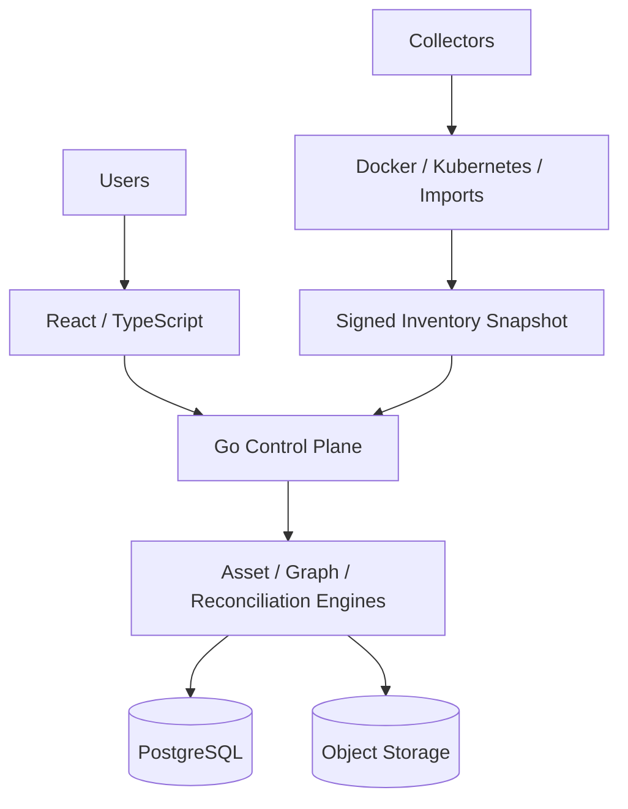
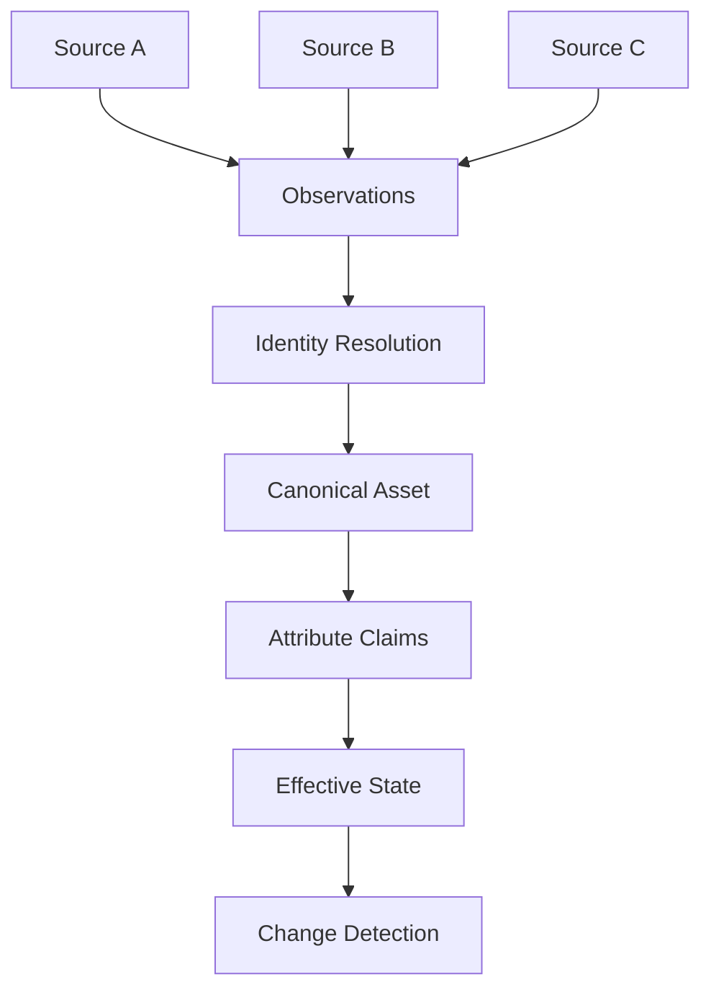

# InfraGraph

[](https://github.com/thiagomontozo/infragraph/actions/workflows/ci.yml)
[](https://github.com/thiagomontozo/infragraph/actions/workflows/codeql.yml)
[](https://github.com/thiagomontozo/infragraph/actions/workflows/security.yml)
[](https://github.com/thiagomontozo/infragraph/actions/workflows/scorecard.yml)
[](https://github.com/thiagomontozo/infragraph/actions/workflows/container.yml)
[](https://github.com/thiagomontozo/infragraph/releases)
[](LICENSE)
[](go.mod)
[](web/package.json)
[](web/package.json)
[](web/tsconfig.json)
[](docs/database.md)
[](compose.yml)
[](https://github.com/thiagomontozo/infragraph/commits/main)
[](https://github.com/thiagomontozo/infragraph/issues)
[](https://github.com/thiagomontozo/infragraph/pulls)
[](https://github.com/thiagomontozo/infragraph/graphs/contributors)
[](https://github.com/thiagomontozo/infragraph/stargazers)
[](https://github.com/thiagomontozo/infragraph/network/members)

InfraGraph continuously reconciles infrastructure observations from multiple sources into a living asset inventory and dependency graph.

> A static inventory tells you what was documented. InfraGraph attempts to show what is currently declared, discovered and observed — and where those sources disagree.

## Why InfraGraph?

InfraGraph answers evidence-oriented questions: what exists now, which sources observed it, which claims conflict, what changed, what was declared but not observed, and what may depend on an asset. It does not silently turn a failed collection into a deletion, a shared hostname into identity, or a graph edge into guaranteed outage propagation.

## Key features

- Living inventory with `DECLARED`, `DISCOVERED`, `OBSERVED`, and deterministic `EFFECTIVE` state.
- Source identities, attribute claims, freshness, identifier strength, conflicts, and explanations.
- Bounded dependency traversal, impact analysis, cycle protection, and accessible relationship tables.
- Separate outbound collector, Ed25519-signed snapshots, replay protection, and read-only Docker/Kubernetes discovery.
- CSV/JSON preview, allowlisted Terraform-state extraction, and a scoped NetScope ingestion contract; previews never apply changes in version 1.0.
- PostgreSQL tenant boundary, server-side sessions, Argon2id, TOTP, CSRF, RBAC, AES-256-GCM envelopes, and tamper-evident audit chaining.
- Local/S3-compatible object storage, migration locking, scheduler leases, Prometheus metrics, health endpoints, and hardened containers.

## Architecture



The API is a modular monolith. It never mounts the Docker socket. Only the separately deployed collector may receive explicitly configured read access to an infrastructure API. See [architecture](docs/architecture.md) and [security model](docs/security-model.md).

## How reconciliation works



Authority is configured per connector, asset type, attribute, or relationship type. Rules are ordered, deterministic, and explainable. Conflicting claims remain visible. `MISSING` requires sufficient successful relevant snapshots; `RETIRED` is an explicit administrative state.

## Living inventory and graph

The version 1.0 web product is an explicitly read-only inventory and inspection surface. Asset 360 exposes effective-state overview and bounded relationship/dependency views. Operational pages inspect changes, findings, connectors, collectors, and audit records; imports validate and preview without apply. User/MFA administration, connector/policy mutation, exports, and merge review are post-1.0 work, not placeholder features. See [product scope](docs/product-scope.md) and [ADR 021](docs/adr/021-v1-read-only-product-scope.md).

Graph requests are organization-scoped, time-bounded, cycle-safe, and capped by depth and node count. The UI loads a progressive subgraph and always offers a table/list alternative.

## Collectors

Protocol 1.0 uses outbound HTTPS. Enrollment tokens are short-lived, single-use, hash-at-rest, and organization scoped. A collector generates an Ed25519 key pair; its private key never leaves the collector. Snapshot ingest checks credential binding, revocation, signature, timestamp, sequence, size, and idempotency. The collector has no arbitrary command execution. See [collector protocol](docs/collector-protocol.md).

## Quick start

Prerequisites are Docker 24+ and Docker Compose v2. Development credentials in `compose.yml` are intentionally non-production.

```bash
git clone https://github.com/thiagomontozo/infragraph.git
cd infragraph
docker compose up --build
```

Bootstrap an owner explicitly after PostgreSQL is ready:

```bash
go run ./cmd/infragraph-bootstrap -database-url "$INFRAGRAPH_DATABASE_URL" -organization "Example" -name "Owner" -email "owner@example.test" -password "$BOOTSTRAP_PASSWORD" -create-collector-token
```

Open `http://localhost:5173`. For tests use `scripts/test.ps1`, `scripts/integration.ps1`, and `scripts/e2e.ps1` on Windows or their `.sh` equivalents on Linux.

## Production deployment

Run behind HTTPS termination with an explicit trusted proxy policy, managed PostgreSQL, S3-compatible object storage, externally supplied 32-byte master key, strong session secret, backups, and monitoring. Production configuration rejects development secrets, wildcard/insecure origins, and debug mode. Start with [production deployment](docs/production-deployment.md), [operations runbook](docs/operations-runbook.md), and [backup/restore](docs/backup-restore.md).

## Security and observability

InfraGraph minimizes collected data: Docker environment variables/logs/secrets, Kubernetes Secret/ServiceAccount data, and arbitrary Terraform attributes are excluded. `/health`, `/startup`, `/ready`, and `/metrics` have distinct semantics. Logs use `slog` and request IDs without secret or high-cardinality metric labels. Report vulnerabilities through a private GitHub Security Advisory; see [SECURITY.md](SECURITY.md).

## Testing and CI/CD

The suite covers domain invariants, graph bounds/cycles, signatures, reconciliation idempotency, parser limits, Terraform minimization, PostgreSQL migrations/isolation, MinIO, labeled synthetic Docker discovery, React Testing Library, Playwright, recovery, and bounded performance. CI additionally runs race detection, `govulncheck`, npm audit, CodeQL, Trivy, Scorecard, SBOM, provenance, and release signing workflows.

## Current status

**Production Candidate — 1.0.0-rc.1.** The version 1.0 [read-only product boundary](docs/product-scope.md) is accepted and reflected in the UI. Production Ready is declared only after every item in the [53-gate production-readiness matrix](docs/production-readiness.md) has recorded evidence. The current operational blockers and supported single-API topology are documented explicitly rather than hidden.

## Limitations and roadmap

V1 is read-only, has no arbitrary remote execution, and does not implement AWS/Azure/GCP/VMware/Proxmox/Hyper-V/NetBox/ServiceNow/Ansible adapters. Process-local rate limiting and per-replica SSE fanout are suitable for a controlled single API instance; multi-replica operators need shared coordination described in [scaling](docs/scaling.md). See [limitations](docs/limitations.md) and [roadmap](docs/roadmap.md).

## Contributing

Read [CONTRIBUTING.md](CONTRIBUTING.md). Changes that weaken provenance, tenant isolation, data minimization, graph bounds, or collector trust are not accepted.

## License

MIT © 2026 Thiago Montozo. See [LICENSE](LICENSE).
