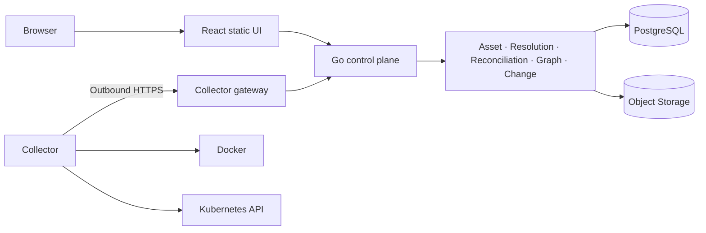

# Architecture

InfraGraph is a modular monolith: one control-plane binary owns HTTP, authentication, inventory, reconciliation, graph queries, change detection, findings, scheduler leases, audit, and artifact metadata. Modules share one PostgreSQL transaction boundary but expose small Go interfaces so storage or graph implementations can evolve without deploying a fleet of services. The React application consumes `/api/v1`; it never talks to infrastructure APIs.

The control plane is stateless outside PostgreSQL and object storage. Sessions and scheduler leases live in PostgreSQL. Artifacts use a pending/final lifecycle because object storage and PostgreSQL are not one ACID system. SSE is a presentation channel, not a durable queue. Every bounded worker owns a context and shutdown deadline.

Trust boundaries are the browser cookie boundary, collector gateway, database, object storage, and each infrastructure API. The API never mounts `/var/run/docker.sock`; production collectors should use a dedicated host or restricted Docker API proxy.

